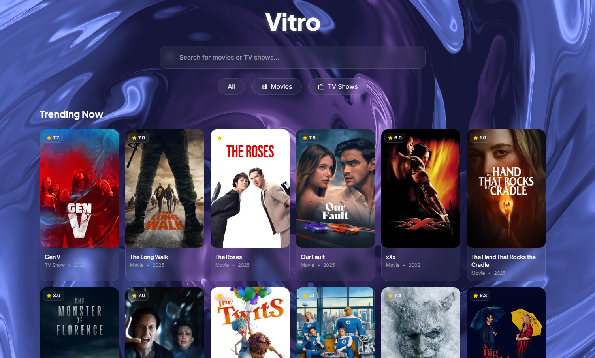
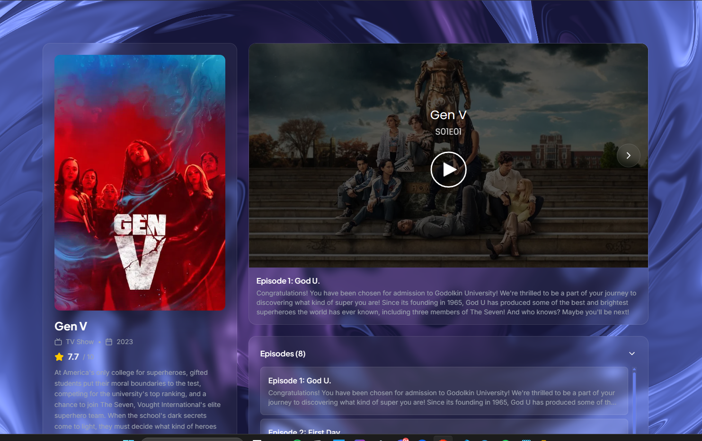

# Vitro

<div align="center">
  <h1>Stream Movies & TV Shows Anywhere</h1>
  <p>Modern, fast, and beautiful streaming experience</p>
</div>

---

## 📸 Preview

### Home Page


### Video Player


---

## ✨ What It Does

Vitro is a modern streaming platform that lets you:

- 🔍 **Search** for any movie or TV show
- 📺 **Browse** trending content and discover new titles
- 🎭 **Filter** by genre to find exactly what you want
- ▶️ **Watch** instantly with no registration required
- ⏯️ **Continue** where you left off with automatic progress tracking
- 📱 **Stream** on any device with a responsive design

---

## 🔄 How It Works

**TMDB API** - Fetches all movie and TV show metadata
- Trending content, search results, and genre lists
- Posters, backdrops, ratings, and descriptions
- Season and episode information for TV shows

**MultiEmbed Player** - Handles video streaming
- Embeds video player via iframe
- Supports movies and TV episodes
- Autoplay and subtitle support

**Local Storage** - Saves your watch progress
- Tracks viewing history
- Remembers last watched episode for TV shows
- Persistent across browser sessions

---

## 🚀 Getting Started

```bash
# Clone the repository
git clone https://github.com/yourusername/vitro.git

# Install dependencies
npm install

# Start the app
npm run dev
```

Open `http://localhost:5173` in your browser.

---

## 🎨 Design

**Vitro** (Latin for "glass") features a glassmorphic design with:
- Translucent glass-effect cards
- Interactive animated background
- Smooth transitions and hover effects
- Clean, modern interface

---

## 📡 Data Sources

- **TMDB API** - Provides movie/TV metadata, posters, and ratings
- **MultiEmbed** - Streams video content

---

## ⚠️ Disclaimer

Vitro does not host any files. It pulls streams from third-party services. All content is provided by external sources.

---

<div align="center">
  <p>Made with ❤️ by <strong>Kira</strong></p>
  <p>⭐ Star this repo if you like it!</p>
</div>
